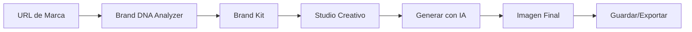

# 🎨 X-Studio

<div align="center">


**Generador de contenido visual con IA para marcas**

*Transforma tu identidad de marca en contenido visual profesional en segundos*

</div>

---

## ✨ Características Principales

### 🧬 **Brand DNA Analyzer**
Analiza automáticamente cualquier sitio web y extrae:
- Paleta de colores con puntuaciones de confianza
- Tipografías detectadas
- Logos y assets visuales
- Tono de voz y valores de marca
- Redes sociales y datos de contacto

### 🎨 **Studio Creativo**
Genera imágenes personalizadas para tu marca:
- **Estilos visuales** predefinidos (Premium, Editorial, Viral, etc.)
- **Layouts** optimizados para diferentes plataformas
- **Presets** guardables y reutilizables
- **Edición con IA** para refinar resultados
- **Vista previa en tiempo real** con ratio adaptable

### 📦 **Brand Kit Manager**
Gestiona múltiples marcas desde un solo lugar:
- Hasta 5 logos por marca
- Paletas de colores personalizables
- Assets visuales organizados
- Contexto de marca editable

### 💳 **Sistema de Créditos**
- Créditos iniciales para beta testers
- Historial de transacciones
- Panel de administración

---

## 🛠️ Tech Stack

| Categoría | Tecnología |
|-----------|------------|
| **Frontend** | Next.js 16, React 19, TypeScript |
| **Estilos** | TailwindCSS 4, Radix UI, Framer Motion |
| **Backend** | Convex (serverless, real-time) |
| **Auth** | Clerk |
| **IA** | Gemini (texto e imagen), Groq, OpenAI |
| **Scraping** | Firecrawl |
| **Deploy** | Vercel |

---

## 🚀 Getting Started

### Prerrequisitos

- Node.js 20+
- npm o pnpm
- Cuenta en [Clerk](https://clerk.com)
- Cuenta en [Convex](https://convex.dev)

### Instalación

```bash
# Clonar el repositorio
git clone https://github.com/tu-usuario/x-studio-convex.git
cd x-studio-convex

# Instalar dependencias
npm install

# Configurar variables de entorno
cp .env.example .env.local
# Editar .env.local con tus claves
```

### Variables de Entorno

```env
# Clerk
NEXT_PUBLIC_CLERK_PUBLISHABLE_KEY=pk_...
CLERK_SECRET_KEY=sk_...

# Convex
CONVEX_DEPLOYMENT=...
NEXT_PUBLIC_CONVEX_URL=https://...

# AI Models
GEMINI_API_KEY=...
GROQ_API_KEY=...
OPENAI_API_KEY=...

# Firecrawl
FIRECRAWL_API_KEY=...
```

### Desarrollo Local

```bash
# Servidor de desarrollo (Next.js + Convex en paralelo)
npm run dev
```

Abre [http://localhost:3000](http://localhost:3000) en tu navegador.

### Desarrollo Móvil

Para probar en dispositivos Android físicos o emuladores:

```bash
# Modo simple: detecta el dispositivo y abre la URL automáticamente
npm run dev:mobile

# Con túnel ngrok (para acceso externo / dispositivos en otra red)
npm run dev:mobile -- --ngrok
```

**¿Qué hace `dev:mobile`?**
1. Arranca Next.js + Convex
2. Detecta dispositivos Android conectados vía ADB
3. Abre automáticamente el navegador en el dispositivo con la URL correcta:
   - **Emulador**: usa `10.0.2.2:3000` (alias al localhost del host)
   - **Dispositivo físico**: usa la IP local de tu máquina
   - **Con `--ngrok`**: usa la URL pública del túnel

> **Requisito**: ADB instalado y en el PATH (viene con Android SDK)

---

## 📁 Estructura del Proyecto

```
x-studio-convex/
├── src/
│   ├── app/                 # App Router (Next.js)
│   │   ├── studio/          # Estudio creativo
│   │   ├── brand-kit/       # Gestión de Brand Kit
│   │   ├── settings/        # Configuración
│   │   ├── admin/           # Panel de administración
│   │   └── api/             # API Routes
│   ├── components/
│   │   ├── studio/          # Componentes del estudio
│   │   ├── brand-dna/       # Componentes de Brand Kit
│   │   ├── layout/          # Layout (Sidebar, Header, etc.)
│   │   ├── ui/              # Componentes UI (Shadcn)
│   │   └── providers/       # Context Providers
│   ├── lib/                 # Utilidades y configuraciones
│   ├── contexts/            # React Contexts
│   └── hooks/               # Custom Hooks
├── convex/                  # Backend Convex
│   ├── schema.ts            # Esquema de la base de datos
│   ├── brands.ts            # Funciones de marcas
│   ├── users.ts             # Funciones de usuarios
│   ├── generations.ts       # Funciones de generaciones
│   └── presets.ts           # Funciones de presets
└── public/                  # Assets estáticos
```

---

## 📜 Scripts Disponibles

| Comando | Descripción |
|---------|-------------|
| `npm run dev` | Servidor de desarrollo (Next.js + Convex) |
| `npm run dev:mobile` | Desarrollo móvil con ngrok |
| `npm run build` | Build de producción |
| `npm run start` | Servidor de producción |
| `npm run lint` | Linting con ESLint |
| `npm run debug` | Chrome debugging mode |

---

## 🎯 Flujo de Trabajo



---

## 🔒 Autenticación y Roles

| Rol | Permisos |
|-----|----------|
| `waitlist` | Solo acceso a landing |
| `beta` | Acceso completo con créditos iniciales |
| `user` | Acceso estándar |
| `admin` | Panel de administración, gestión de usuarios |

---

## 🤝 Contribuir

1. Fork del repositorio
2. Crear rama feature (`git checkout -b feature/nueva-funcionalidad`)
3. Commit de cambios (`git commit -m 'feat: nueva funcionalidad'`)
4. Push a la rama (`git push origin feature/nueva-funcionalidad`)
5. Abrir Pull Request

---

## 📄 Licencia

Este proyecto es privado y propietario.

---

<div align="center">

**Desarrollado con 💚 por el equipo de X-Studio**

</div>
