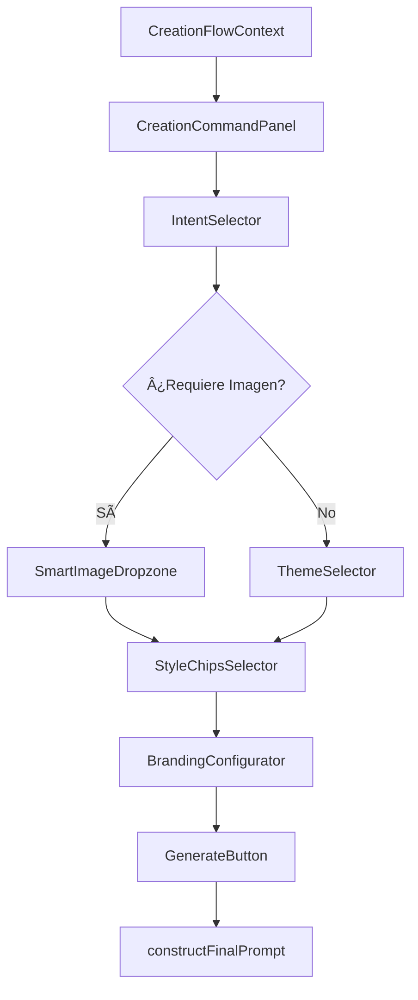

# Cascade Interface: Refactor del Panel Derecho

## Objetivo
Transformar el panel derecho (`CampaignBriefPanel`) en un "Centro de Mando" autosuficiente con interfaz de configuración en cascada (progressive disclosure).

## User Review Required

> [!IMPORTANT]
> Este cambio **reemplaza completamente** `CampaignBriefPanel.tsx` con un nuevo sistema modular. El panel izquierdo (`BrandDNAPanel`) seguirá existiendo pero ya no será necesario arrastrar elementos desde él.

## Arquitectura Propuesta



---

## Cambios Propuestos

### 1. Nuevos Tipos ([NEW] [creation-flow-types.ts](file:///f:/_PROYECTOS/x-studio/src/lib/creation-flow-types.ts))
Interfaces TypeScript para las 20 categorías, flujos de creación, análisis de visión y estado global.

### 2. API de Análisis de Visión ([NEW] [analyze-image/route.ts](file:///f:/_PROYECTOS/x-studio/src/app/api/analyze-image/route.ts))
Endpoint que usa `models/gemini-flash-lite-latest` con la misma API key de pago (`GEMINI_IMAGE_API_KEY`) para analizar imágenes subidas y devolver:
- Sujeto detectado (food, tech, fashion, etc.)
- Iluminación
- Paleta de colores
- Palabras clave visuales

### 3. Hook Principal ([NEW] [useCreationFlow.ts](file:///f:/_PROYECTOS/x-studio/src/hooks/useCreationFlow.ts))
Hook de React que gestiona todo el estado del flujo de creación con funciones para:
- Seleccionar intención
- Subir imagen y llamar al endpoint de análisis
- Seleccionar estilos basados en el análisis real
- Construir el prompt final

### 4. Componentes de UI (Nuevos en `src/components/studio/creation-flow/`)

| Componente | Descripción |
|------------|-------------|
| [CreationCommandPanel.tsx](file:///f:/_PROYECTOS/x-studio/src/components/studio/creation-flow/CreationCommandPanel.tsx) | Panel contenedor principal |
| [IntentSelector.tsx](file:///f:/_PROYECTOS/x-studio/src/components/studio/creation-flow/IntentSelector.tsx) | Grid de grupos + subcategorías |
| [SmartImageDropzone.tsx](file:///f:/_PROYECTOS/x-studio/src/components/studio/creation-flow/SmartImageDropzone.tsx) | Dropzone con análisis Gemini Vision |
| [ThemeSelector.tsx](file:///f:/_PROYECTOS/x-studio/src/components/studio/creation-flow/ThemeSelector.tsx) | Selector de temas (Navidad, Verano...) |
| [StyleChipsSelector.tsx](file:///f:/_PROYECTOS/x-studio/src/components/studio/creation-flow/StyleChipsSelector.tsx) | Chips contextuales según análisis |
| [LayoutSelector.tsx](file:///f:/_PROYECTOS/x-studio/src/components/studio/creation-flow/LayoutSelector.tsx) | **Wireframes en miniatura** filtrados por Intent |
| [BrandingConfigurator.tsx](file:///f:/_PROYECTOS/x-studio/src/components/studio/creation-flow/BrandingConfigurator.tsx) | Logo selector + inputs pre-rellenados |
| [GenerateButton.tsx](file:///f:/_PROYECTOS/x-studio/src/components/studio/creation-flow/GenerateButton.tsx) | Botón con construcción de prompt |

### 5. LayoutSelector: Lógica de Filtrado

> [!IMPORTANT]
> Los layouts se filtran dinámicamente según la `IntentCategory` seleccionada.

| Intent | Layouts Disponibles |
|--------|--------------------|
| `comparativa` | Split Vertical, Split Horizontal, Antes/Después |
| `cita` / `pregunta` | Texto Centro, Texto Pie, Marco |
| `oferta` | Burst Sticker, Banda Inferior, Hero Text |
| `escaparate` | Hero Producto, Grid 2x2, Lifestyle |
| `evento` | Save the Date, Cartel Vertical, Banner |

**Visualización**: Iconos SVG tipo "wireframe" que muestran dónde irá el texto y la imagen.

### 6. Prompt con Instrucciones de Composición

La función `constructFinalPrompt()` incluirá instrucciones de layout:
```
"Composition: Leave empty space at [top-left] for text overlay. 
Text placement zone: 20% from top, centered horizontally."
```

### 4. Integración ([MODIFY] [page.tsx](file:///f:/_PROYECTOS/x-studio/src/app/studio/page.tsx))
Reemplazar `<CampaignBriefPanel>` por `<CreationCommandPanel>`.

---

## Las 20 Categorías Maestras

````carousel
### Grupo A: Venta y Producto
| ID | Nombre | Requiere Imagen |
|----|--------|-----------------|
| `oferta` | La Oferta (Discount) | Sí |
| `escaparate` | El Escaparate | Sí (Studio/Lifestyle/Servicio) |
| `catalogo` | El Catálogo | Sí |
| `lanzamiento` | El Lanzamiento | Opcional |
| `servicio` | El Servicio | No |
<!-- slide -->
### Grupo B: Información
| ID | Nombre | Requiere Imagen |
|----|--------|-----------------|
| `comunicado` | El Comunicado | No |
| `evento` | El Evento | No |
| `lista` | La Lista | No |
| `comparativa` | La Comparativa | Sí (Antes/Después) |
| `efemeride` | La Efeméride | No (Tema) |
<!-- slide -->
### Grupo C: Marca y Personas
| ID | Nombre | Requiere Imagen |
|----|--------|-----------------|
| `equipo` | El Equipo | Sí |
| `cita` | La Cita | No |
| `talento` | El Talento | No |
| `logro` | El Logro | Opcional |
| `bts` | Behind the Scenes | Sí |
<!-- slide -->
### Grupo D: Educación
| ID | Nombre | Requiere Imagen |
|----|--------|-----------------|
| `dato` | El Dato | No |
| `pasos` | El Paso a Paso | No |
| `definicion` | La Definición | No |
<!-- slide -->
### Grupo E: Engagement
| ID | Nombre | Requiere Imagen |
|----|--------|-----------------|
| `pregunta` | La Pregunta | No |
| `reto` | El Reto/Juego | No |
````

---

## Verificación

### Demo Interactiva
1. Abrir el Studio y ver el nuevo panel derecho
2. Seleccionar un grupo (ej: "Vender") y subcategoría ("Escaparate")
3. Subir imagen → ver etiquetas auto-detectadas
4. Elegir chips de estilo
5. Verificar que el Logo Selector muestre los logos del Brand Kit activo
6. Pulsar "Generar" → ver el prompt estructurado en consola

