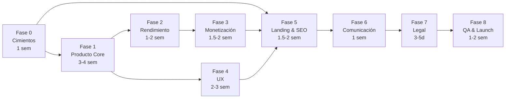

# 🚀 X-Studio — Roadmap hacia el Lanzamiento

> Plan secuencial organizado en fases lógicas con dependencias claras.
> Cada fase se completa antes de pasar a la siguiente (salvo tareas marcadas como paralelizables).
>
> **Estimaciones**: 1 persona, vibecoding (IA-asistido), ~4-6h/día productivas.

---

## Fase 0 · Cimientos Técnicos (Infra & Auth) — ⏱️ ~1 semana

| # | Tarea | ⏱️ | Estado | Notas |
|---|-------|----|--------|-------|
| 0.1 | **Comprar dominio** | 1d | ☐ | Elegir nombre, registrar, configurar DNS en Vercel. **Prerequisito de Clerk**. |
| 0.2 | **Acabar la autenticación de Clerk** | 2-3d | ☐ | Configurar con dominio definitivo. Webhook sync, roles, onboarding. Ya parcialmente hecho. |
| 0.3 | **Seguridad anti-bot y abuso** | 1-2d | ☐ | Rate limiting en middleware + Convex Actions. |
| 0.4 | 🆕 **Logging y monitorización** | 1d | ☐ | Sentry + alertas de coste de API. |

---

## Fase 1 · Producto Core — ⏱️ ~3-4 semanas

| # | Tarea | ⏱️ | Estado | Notas |
|---|-------|----|--------|-------|
| 1.1 | **Acabar Carruseles**: exportar vídeo, edición | 5-7d | ☐ | La más grande. Módulo ya tiene estructura pero falta pulir mucho. |
| 1.2 | **Gestión de plantillas/composiciones** | 3-4d | ☐ | CRUD admin + documentar. Tablas ya existen en Convex. |
| 1.3 | **Enlace entre módulos** (Imagen ↔ Carrusel ↔ Vídeo) | 2-3d | ☐ | Compartir assets/estado entre módulos. |
| 1.4 | **Photoshoot (Pomelli)** | 3-4d | ☐ | Nuevo módulo/extensión. Relativamente aislado. |
| 1.5 | **ChatGPT Image 1.5** | 1-2d | ☐ | Ya tenéis la infra de multi-modelo. Integración rápida. |
| 1.6 | 🆕 **Galería/Historial mejorado** | 2-3d | ☐ | Búsqueda, filtros, favoritos sobre tabla `generations`. |

---

## Fase 2 · Rendimiento y Optimización — ⏱️ ~1-2 semanas

| # | Tarea | ⏱️ | Estado | Notas |
|---|-------|----|--------|-------|
| 2.1 | **Velocidad / Optimizar modelos** | 3-5d | ☐ | Iterativo. Benchmark, cache, streaming. |
| 2.2 | **Coste por generación** en admin | 1-2d | ☐ | Token counting + pricing table. |
| 2.3 | **Límites de guardado por usuario** | 1d | ☐ | Definir y enforcar por plan. |
| 2.4 | 🆕 **Bundle optimization** | 1d | ☐ | Analyzer + lazy loading. Rápido con vibecoding. |

---

## Fase 3 · Monetización — ⏱️ ~1.5-2 semanas

| # | Tarea | ⏱️ | Estado | Notas |
|---|-------|----|--------|-------|
| 3.1 | **Stripe + planes de precios** | 5-7d | ☐ | Checkout, webhooks, sync créditos. Stripe tiene buena docs pero hay muchos edge cases. |
| 3.2 | 🆕 **Portal de suscripción** | 2-3d | ☐ | Stripe Customer Portal agiliza mucho. |
| 3.3 | 🆕 **Créditos extra / pay-per-use** | 1-2d | ☐ | Extensión lógica de la infra de créditos que ya tienes. |

---

## Fase 4 · UX (Mobile + i18n) — ⏱️ ~2-3 semanas

| # | Tarea | ⏱️ | Estado | Notas |
|---|-------|----|--------|-------|
| 4.1 | **Mobile responsive completo** | 7-10d | ☐ | 🔴 **La más laboriosa.** Canvas + editor en móvil es complejo. |
| 4.2 | **i18n ES/EN** | 3-4d | ☐ | Extraer textos hardcodeados de todo el proyecto. Estructura JSON por idioma. |
| 4.3 | 🆕 **Accesibilidad (a11y)** | 1-2d | ☐ | Shadcn/Radix dan buena base. Auditoría y ajustes. |
| 4.4 | 🆕 **Onboarding tour** | 1-2d | ☐ | Librería tipo `react-joyride`. Rápido. |

---

## Fase 5 · Landing, Marketing y SEO — ⏱️ ~1.5-2 semanas

| # | Tarea | ⏱️ | Estado | Notas |
|---|-------|----|--------|-------|
| 5.1 | **Landing page** con vídeo/GIFs | 3-5d | ☐ | Diseño premium. Aquí vibecoding brilla — la IA genera landing rápido. |
| 5.2 | **Auditoría SEO** | 1-2d | ☐ | Meta tags, sitemap, Open Graph. Mecánico. |
| 5.3 | **Redes sociales** | 1d | ☐ | Crear perfiles. No es código, es gestión. |
| 5.4 | 🆕 **Blog / Content marketing** | 2-3d | ☐ | Setup de MDX o CMS. Contenido se escribe después. |
| 5.5 | 🆕 **Analytics** | 1d | ☐ | GA4 o PostHog. Copy-paste de snippets + eventos. |

---

## Fase 6 · Comunicación y Soporte — ⏱️ ~1 semana

| # | Tarea | ⏱️ | Estado | Notas |
|---|-------|----|--------|-------|
| 6.1 | **Emails transaccionales** | 2-3d | ☐ | Resend con templates. Bienvenida, alertas, etc. |
| 6.2 | **Documentación y ayuda** | 2-3d | ☐ | Vídeos + FAQ. El contenido lleva tiempo pero no es código complejo. |
| 6.3 | 🆕 **Notificaciones in-app** | 1d | ☐ | Sistema de toasts + panel básico. |

---

## Fase 7 · Legal y Compliance — ⏱️ ~3-5 días

| # | Tarea | ⏱️ | Estado | Notas |
|---|-------|----|--------|-------|
| 7.1 | **Páginas legales** (Privacidad, Cookies, TdU) | 1-2d | ☐ | Generador legal + adaptación. Banner cookies. |
| 7.2 | 🆕 **Licencia de contenido IA** | 1d | ☐ | Texto legal, no código. |
| 7.3 | 🆕 **RGPD** (export/delete datos) | 1-2d | ☐ | "Eliminar cuenta" + "Descargar datos" en `/settings`. |

---

## Fase 8 · QA & Launch — ⏱️ ~1-2 semanas

| # | Tarea | ⏱️ | Estado | Notas |
|---|-------|----|--------|-------|
| 8.1 | 🆕 **Testing E2E** (Playwright) | 2-3d | ☐ | Flujos críticos. Ya tienes Playwright configurado. |
| 8.2 | 🆕 **Beta testing** con usuarios reales | 5-7d | ☐ | ⏳ Tiempo calendario, no de desarrollo. Esperar feedback. |
| 8.3 | 🆕 **Load testing** | 1d | ☐ | k6 o Artillery contra staging. |
| 8.4 | 🆕 **Backup strategy** | 0.5d | ☐ | Convex snapshots. Configuración rápida. |

---

## 📊 Resumen de Tiempos

| Fase | Estimación | Acumulado |
|------|-----------:|----------:|
| **F0** Cimientos | ~1 semana | 1 sem |
| **F1** Producto Core | ~3-4 semanas | 5 sem |
| **F2** Rendimiento | ~1-2 semanas | 7 sem |
| **F3** Monetización | ~1.5-2 semanas | 9 sem |
| **F4** UX (Mobile+i18n) | ~2-3 semanas | 12 sem |
| **F5** Landing & SEO | ~1.5-2 semanas | 14 sem |
| **F6** Comunicación | ~1 semana | 15 sem |
| **F7** Legal | ~3-5 días | 15.5 sem |
| **F8** QA & Launch | ~1-2 semanas | **~17 sem** |

### 🎯 Total estimado: **~4-5 meses** hasta lanzamiento público

> **Aceleradores**: Fases 1 y 4 pueden solaparse parcialmente. Con vibecoding agresivo, la landing (F5) y legal (F7) se pueden comprimir bastante. El cuello de botella real es **F1 (Producto core)** y **F4 (Mobile)**.

> **La beta (8.2) añade tiempo calendario** — no es desarrollo, es esperar feedback de usuarios reales. Puede solaparse con pulido de bugs.

---

## 🗺️ Diagrama de Dependencias

---

## 🌐 Investigación de Dominio

### Candidatos verificados (DNS check 24/02/2026)

#### Dominios `.com` (preseleccionados)

| Dominio | Keywords | Memo | Pronunc. | Long. | Brand | TLD | **Total /60** |
|---------|:--------:|:----:|:--------:|:-----:|:-----:|:---:|:---:|
| CreativePostAI.com | 9 | 5 | 5 | 4 | 5 | 10 | **38** |
| SocialCanvasAI.com | 8 | 5 | 5 | 4 | 4 | 10 | **36** |
| SocialCreativeAI.com | 8 | 4 | 4 | 3 | 4 | 10 | **33** |
| AIPostMaker.com | 9 | 6 | 5 | 5 | 5 | 10 | **40** |

#### Dominios `.click` — descriptivos (✅ libres)

| Dominio | Keywords | Memo | Pronunc. | Long. | Brand | TLD | **Total /60** |
|---------|:--------:|:----:|:--------:|:-----:|:-----:|:---:|:---:|
| brandpost.click | 7 | 7 | 7 | 7 | 8 | 5 | **41** |
| visualpost.click | 7 | 6 | 6 | 6 | 7 | 5 | **37** |
| postlab.click | 5 | 7 | 8 | 8 | 7 | 5 | **40** |
| socialpostai.click | 9 | 5 | 5 | 5 | 5 | 5 | **34** |
| creativepostai.click | 9 | 4 | 4 | 4 | 4 | 5 | **30** |
| makepost.click | 7 | 7 | 7 | 7 | 6 | 5 | **39** |
| posthub.click | 5 | 7 | 8 | 8 | 6 | 5 | **39** |
| postio.click | 3 | 8 | 8 | 9 | 8 | 5 | **41** |

#### Dominios `.click` — brandables (✅ libres)

| Dominio | Keywords | Memo | Pronunc. | Long. | Brand | TLD | **Total /60** |
|---------|:--------:|:----:|:--------:|:-----:|:-----:|:---:|:---:|
| creatsy.click | 4 | 8 | 7 | 8 | 8 | 5 | **40** |
| crafty.click | 3 | 8 | 7 | 9 | 7 | 5 | **39** |
| mavu.click | 1 | 7 | 8 | 10 | 7 | 5 | **38** |
| vibly.click | 1 | 7 | 7 | 9 | 7 | 5 | **36** |
| socialy.click | 6 | 7 | 6 | 8 | 6 | 5 | **38** |

#### Dominios `.click` — con "studio" (✅ libres)

| Dominio | Notas |
|---------|-------|
| brandstudio.click | Brand + Studio. Describe la app perfectamente. |
| socialstudio.click | Social + Studio. SEO directo. |
| vizstudio.click | Visual + Studio. Corto y moderno. |
| feedstudio.click | Feed (social) + Studio. |
| makestudio.click | Make + Studio. Acción directa. |
| studiofy.click | Studio + -fy. Brandable. |
| sparkstudio.click | Spark + Studio. Chispa creativa. |

#### Dominios `.click` — pronunciables tipo marca (✅ libres)

| Dominio | Sílabas | Significado |
|---------|---------|-------------|
| **Kreavo** | KRE-a-vo | Crear + bravo. Premium. |
| **Bravio** | BRA-vio | Brand + bravo. Latino. |
| **Krello** | KRE-llo | Como Trello pero para creación. |
| **Prizma** | PRIZ-ma | Prisma → muchos colores, facetas. |
| **Kanvo** | KAN-vo | Evoca "canvas" sin ser Canva. |
| **Glinto** | GLIN-to | Glint = destello. Brillante. |
| **Vixel** | VI-xel | Visual + pixel. Tech pero cálido. |
| **Crafteo** | CRAF-te-o | Spanglish natural. |
| **Vizzo** | VI-zzo | Visual + pizzazz. Italiano. |
| **Kreata** | KRE-a-ta | Crear + -ata. Elegante. |

### 🏆 Top 5 Global

| # | Dominio | Score | Porqué |
|---|---------|:-----:|--------|
| 1 | **brandpost.click** | 41 | Mejor equilibrio keywords + branding |
| 2 | **postio.click** | 41 | Ultra-compacto, muy memorable |
| 3 | **kreavo.click** | — | Mejor marca pronunciable |
| 4 | **AIPostMaker.com** | 40 | Mejor SEO puro (.com) |
| 5 | **prizma.click** | — | Icónico, universal |

---

## 📌 Notas Importantes

1. **Las Fases 1 y 4 pueden avanzar en paralelo** — mientras completas features, puedes ir adaptando a mobile.
2. **La Fase 5 (Landing) depende de la Fase 3 (Pricing)** — necesitas saber los planes antes de mostrarlos en la landing.
3. **La Fase 7 (Legal) es bloqueante para el lanzamiento público** — no se puede abrir al público sin cookies, RGPD y términos.
4. **Las tareas marcadas con 🆕** son las que se han detectado como necesarias y no estaban en la lista original.
5. **i18n** ya tiene infraestructura base con `react-i18next`, pero solo definiciones en español hardcodeadas. Necesita extracción a archivos JSON separados por idioma.
6. **El módulo de vídeo** (`/video`) existe pero está en fase muy temprana. Se beneficiará del trabajo del carrusel.

---

*Última actualización: 24/02/2026*
